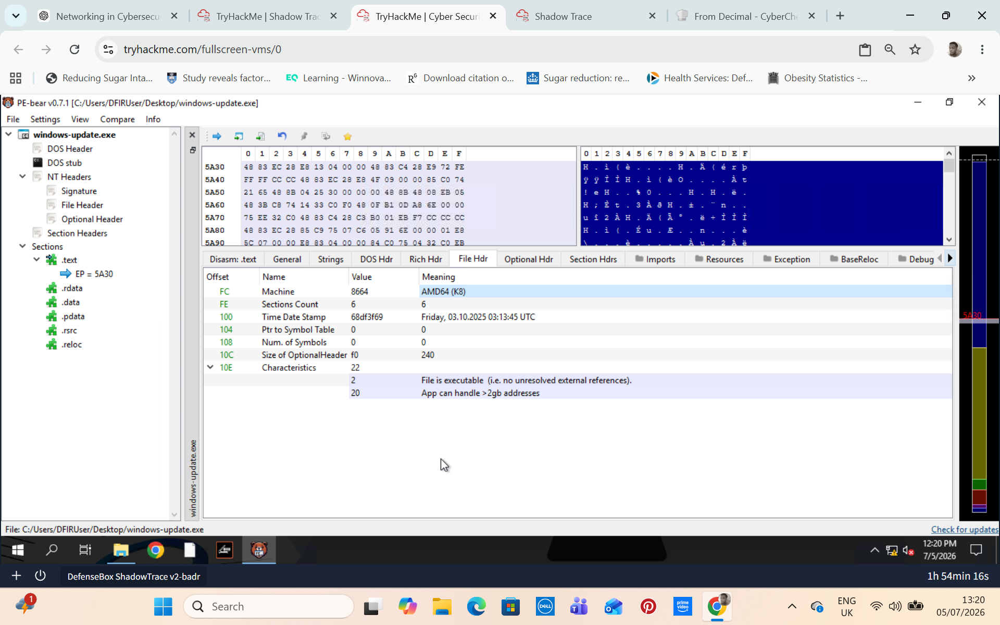
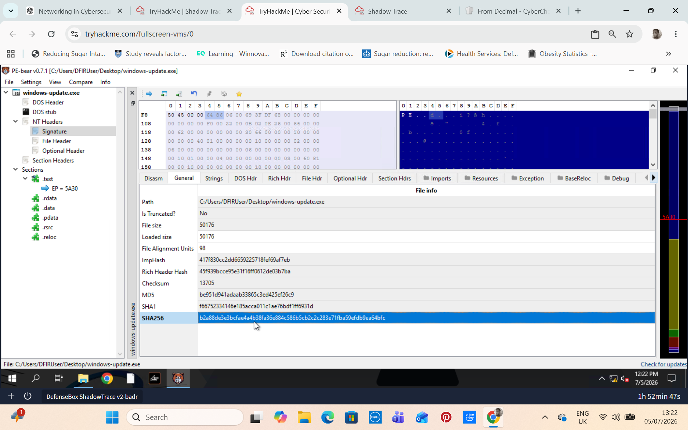
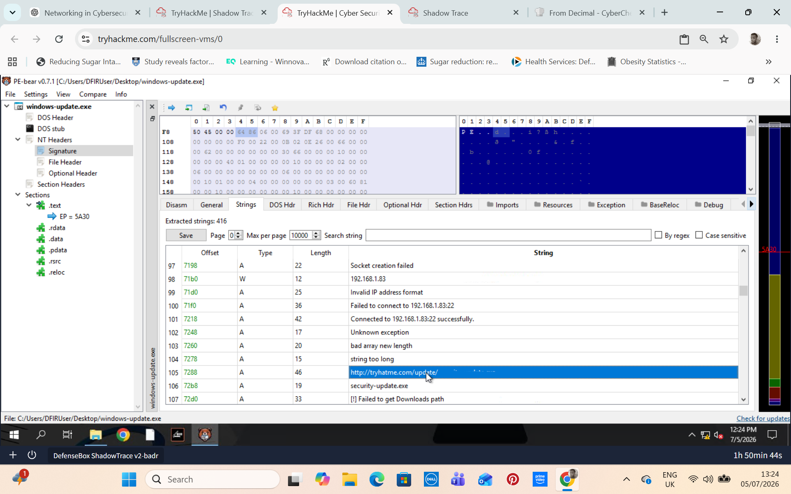
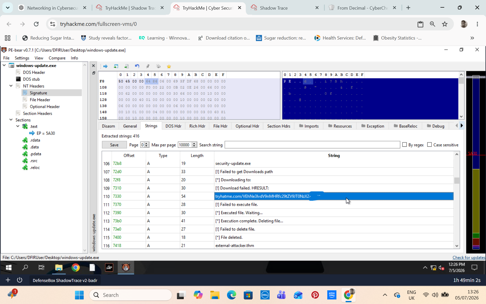
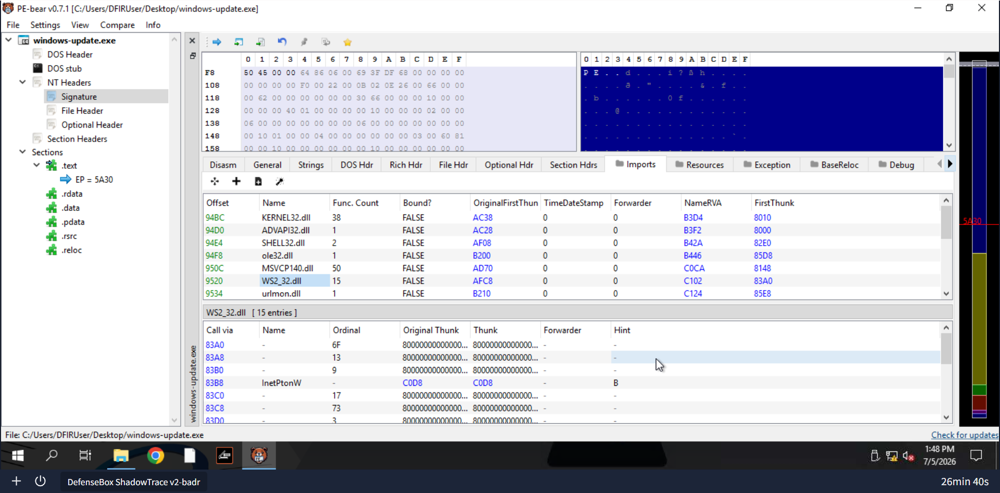
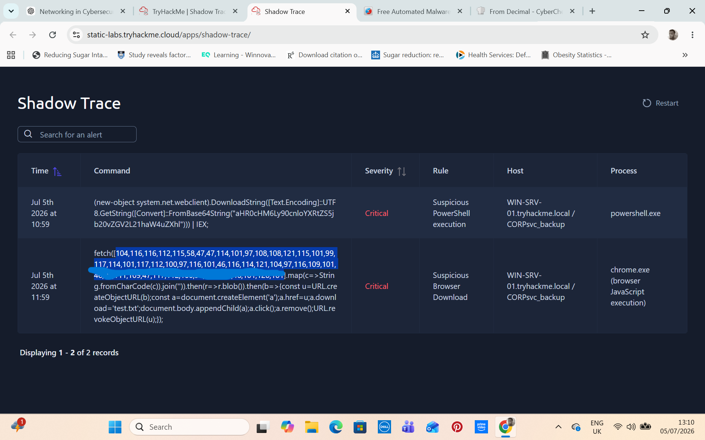
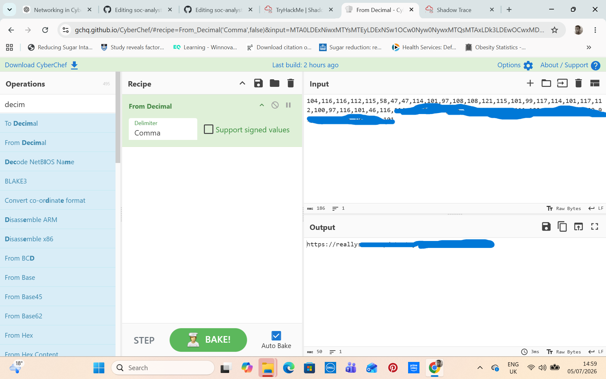

# Suspicious Updater Malware Triage – SOC Investigation Lab

## Project Overview

This project documents a simulated SOC investigation involving a suspicious file discovered on a user's endpoint.

In this scenario, I was acting as a SOC analyst when a manager urgently requested a review of a suspicious file found on a user machine. The file appeared unusual when compared with the organisation’s normal updater, and the EDR generated multiple alerts linked to the activity.

The objective of the investigation was to analyse the suspicious file, identify indicators of compromise, correlate the EDR/SIEM alerts with malicious behaviour, and perform basic SOC triage actions.

## Scenario Summary

A suspicious file was identified on a Windows endpoint. The file appeared to imitate or resemble a legitimate company updater, but several characteristics made it suspicious.

At the same time, the endpoint security tooling generated alerts involving suspicious PowerShell and browser-based activity. The investigation focused on determining whether the file and alerts were linked to malicious activity.

## Objectives

The main objectives of this investigation were to:

* Perform basic static analysis of the suspicious file.
* Identify the file architecture.
* Generate and record the file hash.
* Extract indicators of compromise from the binary.
* Identify suspicious URLs and encoded content.
* Determine the socket communication library used by the binary.
* Investigate SIEM/EDR alerts linked to PowerShell and Chrome activity.
* Decode suspicious encoded URLs.
* Correlate file findings with alert activity.
* Recommend basic SOC triage and containment actions.

## Tools Used

| Tool                         | Purpose                                             |
| ---------------------------- | --------------------------------------------------- |
| PE-Bear                      | Static analysis of the Windows PE file              |
| Strings analysis             | Extracting readable strings from the binary         |
| CyberChef                    | Decoding Base64 and ASCII-encoded content           |
| SIEM/EDR alerts              | Reviewing suspicious endpoint activity              |
| Windows analysis environment | Safe investigation of the suspicious file           |

## Investigation Process

### 1. Initial File Review

The suspicious file was reviewed on a Windows analysis system. The file appeared unusual when compared with the expected company updater, which raised suspicion that it may have been masquerading as a legitimate updater.

The initial focus was to determine the file type, architecture, hash value, and whether it contained any suspicious embedded strings or network indicators.

### 2. Static Analysis with PE-Bear

I used PE-Bear to perform static analysis of the suspicious Windows binary.

During this phase, I reviewed the PE file structure, including the file header, to identify key information about the binary.

Key areas reviewed included:

* File header
* Architecture
* Imported libraries
* Strings
* Potential network-related functionality

### 3. Binary Architecture Identification



Using PE-Bear, I reviewed the file header and identified the binary architecture.

The file was identified as a **64-bit binary** based on the architecture information shown in the PE header.

This helped determine that the correct debugger for deeper analysis would be **x64dbg**, rather than x32dbg.

### 4. File Hash Identification



PE-Bear was used to identify the hash of the file.

The SHA256 hash can be used for:

* Threat intelligence lookup
* IOC sharing
* SIEM correlation
* EDR investigation
* Blocking or alerting rules

Example PowerShell command used:

### 5. String Analysis and IOC Extraction



I reviewed the strings within the suspicious binary to identify potential indicators of compromise.

During this analysis, I identified a suspicious URL embedded inside the file. This URL was treated as an IOC because it could represent command-and-control infrastructure, a payload download location, or another malicious resource.

The investigation also revealed a Base64-encoded response from a suspicious domain. This required decoding to understand the hidden content.

### 6. Base64 Decoding



A Base64-encoded value was identified during the investigation.

I decoded the value to reveal the hidden content and determine whether it contained an IOC or other useful investigative information.

CyberChef was used to decode the Base64 content safely.

### 7. Socket Communication Library Identification



While reviewing the binary, I identified the DLL related to socket communication.

The library identified was associated with Windows socket/network communication. This was important because it suggested that the binary may be capable of network communication.

This finding supported the suspicion that the file may attempt to communicate externally.

### 8. SIEM/EDR Alert Review

The SIEM/EDR generated alerts involving suspicious activity linked to endpoint processes.

Two notable process-related findings were reviewed:

* `powershell.exe`
* `chrome.exe`

The PowerShell alert contained an encoded URL that required decoding. This indicated possible suspicious script-based execution or staged activity.

The Chrome-related alert contained an ASCII-encoded URL. The URL was decoded by converting decimal ASCII values into readable text.

### 9. ASCII-Encoded URL Decoding



One alert contained a URL represented as decimal ASCII values.

The encoded format was similar to:

```text
104,116,116,112,115,58,47,47
```

This type of encoding can be used to hide URLs from simple detection or casual inspection.

Using CyberChef, I decoded the decimal ASCII values into a readable URL.

CyberChef recipe used:



```text
From Decimal
Delimiter: Comma
```

This helped reveal the actual URL involved in the suspicious browser-based activity.

## Indicators of Compromise

The investigation produced several IOCs that could be used for detection and further investigation.

| IOC Type               | Description                                          |
| ---------------------- | ---------------------------------------------------- |
| SHA256 hash            | Unique hash of the suspicious binary                 |
| Suspicious URL         | URL extracted from the binary strings                |
| Encoded Base64 content | Base64 response linked to suspicious domain activity |
| ASCII-encoded URL      | URL decoded from Chrome-related activity             |
| Suspicious process     | `powershell.exe` involved in encoded URL activity    |
| Suspicious process     | `chrome.exe` involved in ASCII-encoded URL activity  |
| Network library        | Socket communication DLL identified in the binary    |

## Alert Correlation

The file analysis and SIEM/EDR alerts appeared to support the same overall pattern of suspicious activity.

The suspicious binary contained network-related indicators, while the endpoint alerts showed encoded URL activity involving PowerShell and Chrome.

This correlation suggested that the suspicious file was likely linked to malicious or unauthorised activity rather than being a normal company updater.

## Basic SOC Triage Actions

Based on the findings, the following SOC triage actions would be appropriate:

1. **Isolate the affected endpoint**

   * Prevent further communication with suspicious infrastructure.
   * Stop potential lateral movement or additional payload download activity.

2. **Preserve evidence**

   * Record the file hash.
   * Save relevant SIEM/EDR alert details.
   * Preserve the suspicious file for further analysis.

3. **Block identified IOCs**

   * Block the suspicious URL/domain at the proxy, firewall, DNS, or EDR level.
   * Add the SHA256 hash to detection or blocklists where appropriate.

4. **Review related endpoint activity**

   * Investigate PowerShell execution history.
   * Review browser activity involving the decoded URL.
   * Check for file creation, persistence, registry changes, or additional payloads.

5. **Search across the environment**

   * Hunt for the same SHA256 hash on other endpoints.
   * Search SIEM logs for the decoded URLs.
   * Review whether other users or systems contacted the suspicious domain.

6. **Escalate for deeper analysis**

   * Escalate to senior analysts or incident response if evidence suggests active compromise.
   * Recommend further dynamic malware analysis in a controlled sandbox if needed.

## Key Skills Demonstrated

This project demonstrates the following SOC and malware analysis skills:

* Static malware analysis
* Windows PE file analysis
* File hash generation
* IOC extraction
* String analysis
* Base64 decoding
* ASCII decoding
* SIEM/EDR alert review
* Alert correlation
* Basic incident triage
* Suspicious process investigation
* Malware-related network indicator analysis
* Clear documentation of findings

## Lessons Learned

This lab helped reinforce the importance of combining file analysis with alert investigation.

Static analysis of the binary provided useful indicators such as architecture, file hash, strings, URLs, and imported libraries. However, the SIEM/EDR alerts provided additional context by showing how suspicious activity appeared on the endpoint.

The key lesson is that malware triage is not just about analysing a file in isolation. A SOC analyst must also correlate file-based findings with endpoint alerts, process activity, network indicators, and encoded content to understand the full picture.

## Conclusion

The suspicious file showed multiple signs of malicious or unauthorised activity. Through static analysis and alert correlation, I identified several indicators of compromise, including a SHA256 hash, suspicious URLs, encoded content, socket-related communication capability, and suspicious activity involving PowerShell and Chrome.

The findings supported further containment, IOC blocking, endpoint review, and escalation for deeper investigation.
