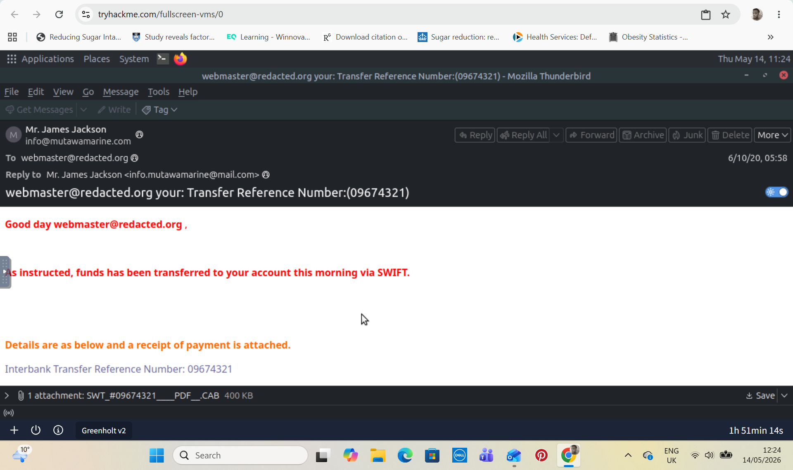

# Phishing Email Investigation Case Study

## Overview

This project documents a phishing email investigation conducted as part of a SOC Analyst simulation exercise. The objective was to determine whether a suspicious email received by a staff member in the Sales department was legitimate or part of a phishing campaign.

The investigation involved:
- Email header analysis
- Source IP and domain reputation checks
- File hash analysis
- Malware verification using VirusTotal
- Threat classification

---

## Scenario

A member of the Sales department received a suspicious email appearing to originate from a known customer. Several indicators immediately raised concern:

- Generic greeting
- Unsolicited money transfer 
- Suspicious attachment
- Unexpected communication behavior

The email was escalated to the SOC team for analysis.

---

## Investigation Process

### 1. Initial Email Review

The email content was reviewed for common phishing indicators.

### Observed Indicators
- Generic salutation
- Social engineering tactics
- Suspicious attachment

### Email Screenshot



---

## 2. Email Header and Source Analysis

The message source/header was examined to identify the originating IP address and sending infrastructure.

The originating IP address and associated domain were investigated using:

- VirusTotal
- Domain reputation analysis

The results showed that the originating domain had a suspicious reputation and was associated with malicious activity.

### Message Source Screenshot


---

## 3. Attachment Analysis

The email attachment was downloaded and analyzed in a controlled environment.

A SHA256 hash was generated using Linux:

```bash
sha256sum suspicious_attachment.zip
```

### Linux Hashing Screenshot


---

## 4. Malware Verification

The generated SHA256 hash was searched on VirusTotal to determine whether the attachment had previously been identified as malicious.

The hash returned positive detections from multiple security vendors, confirming the attachment as malware.

### VirusTotal Hash Result Screenshot


---

## Findings

| Indicator | Result |
|---|---|
| Generic greeting | Suspicious |
| Unsolicited financial payment | Suspicious |
| Attachment reputation | Malicious |
| VirusTotal detections | Positive |
| Originating domain reputation | Suspicious |
| Overall classification | Phishing Email |

---

## Conclusion

Based on the investigation findings, the email was classified as a phishing attempt.

The investigation confirmed:
- The originating domain was suspicious
- The attachment was malicious
- The email contained multiple phishing indicators consistent with social engineering tactics

---

## Skills Demonstrated

- Email threat analysis
- Phishing investigation
- Email header analysis
- Linux command-line usage
- SHA256 hash generation
- Malware reputation analysis
- VirusTotal investigation
- Threat classification
- SOC workflow documentation

---

## Tools Used

- Linux
- sha256sum
- VirusTotal
- Email client message source analysis

---

## MITRE ATT&CK Mapping

| Technique | Description |
|---|---|
| T1566.001 | Phishing: Spearphishing Attachment |
| T1204 | User Execution |
| T1588 | Obtain Capabilities |

---

## Lessons Learned

- Known senders can still be compromised or spoofed
- Hash reputation analysis is critical for malware validation
- Email header analysis helps identify suspicious infrastructure

---

## Disclaimer

This project was completed in a controlled lab/simulation environment for cybersecurity training and educational purposes only.
