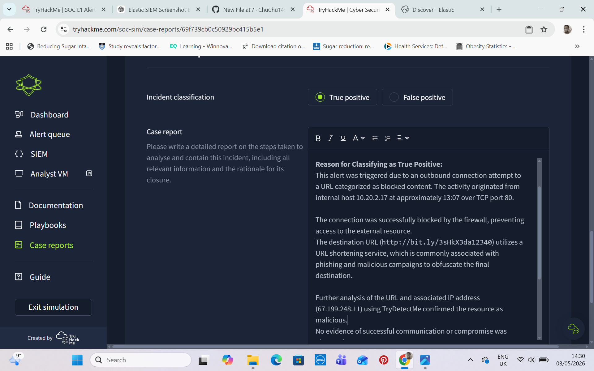

# 🚨 Alert Case Study: Malicious URL Connection Attempt (Blocked)

## 📌 Overview

- **Alert Type:** Malicious URL / Web Traffic  
- **Severity:** High  
- **Time of Activity:** 18:02  
- **Environment:** SIEM Lab (Elastic SIEM)  

---

## 🎯 Objective

To investigate an outbound connection attempt to a blocked URL, validate its maliciousness, and determine whether any compromise occurred.

---

## 🧾 Alert Details

- **Trigger:** Outbound connection to URL categorized as blocked content  
- **Source IP:** 10.20.2.17  
- **Source Port:** 34257  
- **Destination IP:** 67.199.248.11  
- **Destination Port:** 80  
- **URL:** http://bit.ly/3sHkX3da12340

  

*SIEM view showing alert trigger, source, destination, and classification*

---

## 🔍 Investigation Process

1. Reviewed alert details in the SIEM dashboard  
2. Identified source and destination network information  
3. Analysed destination URL and IP address  
4. Investigated URL using threat intelligence tools  
5. Reviewed firewall action to confirm whether the connection was allowed or blocked  

---

## 🔎 Findings

- The connection originated from internal host **10.20.2.17**  
- The request targeted external IP **67.199.248.11** over HTTP (port 80)  
- The URL uses a **URL shortening service (bit.ly)**  
- URL analysis confirmed the destination as **malicious**  
- The firewall **successfully blocked** the connection attempt  
- No further suspicious activity or repeated attempts were observed  

---

## 🧠 Analysis

The alert was triggered due to an outbound connection attempt to a known malicious URL.

Key indicators include:

- **Malicious URL confirmed via threat intelligence**  
- **Use of URL shortener** to obfuscate the final destination  
- **Firewall enforcement** successfully prevented access  

The source port (**34257**) is an ephemeral port, indicating a standard outbound connection initiated by the host.

---

## ⚠️ Risk Assessment

- **Threat:** Confirmed malicious URL  
- **Impact:** None (connection blocked)  
- **Likelihood:** Medium (possible user click or background process)  

---

## ✅ Conclusion

**Classification:** True Positive – Blocked Activity  

This alert represents a confirmed malicious connection attempt. However, the firewall successfully blocked the request, and no evidence of compromise was identified.

---

## 🛠️ Recommended Actions

- Continue monitoring host **10.20.2.17** for repeated attempts  
- Verify whether the activity originated from user interaction (e.g. phishing email)  
- Ensure the malicious domain/IP remains blocked across all security controls  
- Consider endpoint inspection if repeated activity is observed  

---

## 🚫 Escalation Decision

No escalation required.  
The threat was successfully mitigated by existing security controls, and no compromise occurred.

---

## 🔗 Indicators of Compromise (IOCs)

- **Destination IP:** 67.199.248.11  
- **Destination Port:** 80  
- **URL:** http://bit.ly/3sHkX3da12340  

---

## 🖼️ Evidence

*Connection attempt details including source and destination*

---

## 📚 Key Learnings

- URL shorteners are commonly used to disguise malicious links  
- Firewall controls play a critical role in preventing compromise  
- Destination IP and URL analysis are key in validating threats  
- Blocked activity can still indicate underlying user or system risk  

---

## 🖼️ Evidence

*Final incident view showing alert classification and investigation summary*

## 🧠 Analyst Reflection

This case demonstrates the importance of validating blocked threats. Even when security controls prevent access, identifying the root cause (user action or automated process) is essential for preventing future incidents.
